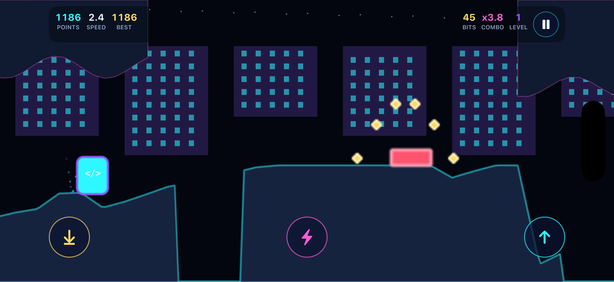

# ⚡ Tech Flow Runner

### A fast-paced, neon circuit-board endless runner

Guide the Runner across a glowing motherboard — leap past hazards, dash through
enemies, chain combos, and climb the leaderboard while an original soundtrack
drives the action.

---

## 📑 Contents

- [About the Game](#-about-the-game)
- [Where to Play](#-where-to-play)
- [User Guide](#-user-guide)
  - [The Goal](#the-goal)
  - [Controls](#controls)
  - [Core Moves](#core-moves)
  - [Bits & Combos](#bits--combos)
  - [Power-Ups](#power-ups)
  - [Run Modifiers](#run-modifiers)
  - [The Mainframe Boss](#the-mainframe-boss)
  - [Scoring](#scoring)
  - [Skins & Unlocks](#skins--unlocks-ios)
  - [Daily Seed Mode](#daily-seed-mode-ios)
  - [Leaderboards](#leaderboards)
- [Tips & Strategy](#-tips--strategy)
- [Accessibility](#-accessibility)
- [FAQ & Troubleshooting](#-faq--troubleshooting)
- [Privacy](#-privacy)
- [Support & Contact](#-support--contact)
- [License](#-license)

---

## 🎮 About the Game

**Tech Flow Runner** is a neon, circuit-board endless runner. The Runner
auto-scrolls across a living motherboard at an ever-increasing pace while you
time jumps, ducks, and dashes to survive. Collect **bits**, chain your actions
into a **combo multiplier**, grab **power-ups**, push through progressively
harder terrain, and survive the **Mainframe boss fight** — then compare your
best runs on the leaderboard.

The objective is simple to learn and hard to master: **survive, build your
combo, collect bits, and climb the leaderboard.**

| | |
| --- | --- |
| 🕹️ **Easy to learn** | One-tap jumping gets you playing in seconds |
| 🔥 **Hard to master** | Combo chains, power-up timing, and modifiers reward skill |
| 🎵 **Original soundtrack** | A custom score by H3 Consulting Partners LLC |
| 🏆 **Leaderboards** | Game Center (iOS) and a global web leaderboard |
| ♿ **Accessible** | Reduced-motion support, on-screen controls, and clear status messaging |
| 🔒 **Privacy-first** | No accounts, no developer-run tracking servers |

---

## 📲 Where to Play

Tech Flow Runner shares the same gameplay identity across platforms. Each
platform has its own setup and technical notes:

| Platform | Highlights | Details |
| --- | --- | --- |
| **📱 Native iOS** | iPhone & iPad, Game Center leaderboards & achievements, unlockable skins, Daily Seed, fully offline | [`TechFlowRunner/README.md`](TechFlowRunner/README.md) |
| **🌐 Web / PWA** | Plays in any modern browser, installable as an app, offline after first load, global leaderboard | [`web-app/README.md`](web-app/README.md) |

---

## 📖 User Guide

Everything you need to start playing — and to start winning.

### The Goal

Run as far as you can. The track never ends; it only gets faster and more
crowded. Every obstacle you clear, every bit you grab, and every combo you keep
alive adds to your score. One wrong move (or one too many, depending on your
[modifier](#run-modifiers)) ends the run — so the real game is seeing how long
you can keep the flow going.

### Controls

Controls map naturally to each platform, but the core actions are identical
everywhere.

**📱 iOS (touch)**

| Action | Gesture |
| --- | --- |
| Jump / double jump | **Tap** the screen |
| Duck | **Swipe down** (and hold) |
| Dash | **Swipe right** |
| Jump / Duck / Dash | **On-screen buttons** (accessibility fallback) |
| Pause | **On-screen Pause button** |

> During an active run the iPhone/iPad is locked to **landscape** so every
> player gets the same play area and the leaderboard stays fair. Menus work in
> any orientation.

**🌐 Web (keyboard, mouse & touch)**

| Action | Input |
| --- | --- |
| Jump / double jump | **Space**, **W**, **Up Arrow**, or **tap / click** |
| Pause / resume | **P** or **Esc** |
| Mute / unmute | **M** (remembered between sessions) |
| Restart after game over | **R** |

### Core Moves

- **Jump** — clear low hazards and gaps. Tap or press the jump key.
- **Double Jump** — tap/press a second time while airborne for extra height or a
  last-second correction. *(Disabled in the [Hardcore](#run-modifiers)
  modifier.)*
- **Duck** — slide under high obstacles and incoming fire. Hold the duck input
  to stay low.
- **Dash** — a quick burst that powers you through or past certain threats and
  helps you reposition. Use it deliberately — timing matters.

### Bits & Combos

- **Bits** are the glowing collectibles scattered along the track. Grab them for
  points and to feed your score multiplier.
- **Combos** build as you chain actions and collect bits without missing. Your
  **combo multiplier** climbs up to **8×**, dramatically boosting everything you
  score.
- Keep the chain alive — let the combo timer (about **3 seconds**) lapse without
  action and the multiplier resets. Staying in "the flow" is where the big
  scores come from.

### Power-Ups

Power-ups appear along the track and grant temporary advantages. Grab them as
you pass.

| Power-Up | Symbol | Effect | Duration |
| --- | :---: | --- | --- |
| **Shield** | 🛡️ `S` | Absorbs a single hit that would otherwise end your run | Until used |
| **Overclock** | ⚡ `O` | Doubles your score (**2×**) while active | ~5 seconds |
| **Magnet** | 🧲 `M` | Pulls nearby bits toward you so you collect them automatically | ~7 seconds |
| **Slow-Mo** | 🌀 `~` | Slows the game down so you can thread tight sections | ~4 seconds |

> Tip: stack a **Shield** for safety, then trigger an **Overclock** during a
> dense, bit-rich stretch to spike your score.

### Run Modifiers

Before a run (iOS) you can pick a **modifier** that changes the rules — and your
score multiplier. Modifiers raise the risk and the reward, and each has its own
leaderboard.

| Modifier | What changes | Score |
| --- | --- | :---: |
| **No Modifier** | Standard mode. Double jump and shields enabled. Start with 1 shield. | 1.0× |
| **Bit Rush** | **2× bits**, but no shields. | 1.2× |
| **Feather Fall** | Lower gravity, floatier jumps. Start with 1 shield. | 1.25× |
| **Hardcore** | **No double jump.** | 1.5× |
| **Glass Cannon** | No shields — **one hit ends the run.** | 1.75× |

### The Mainframe Boss

Push far enough and the run culminates in a **Mainframe boss fight** — a
higher-intensity encounter that tests everything you've learned about jumping,
ducking, dashing, and power-up timing. Defeating bosses also counts toward
unlocking the **Bossbane** skin on iOS.

### Scoring

Your score rewards staying alive and staying aggressive. Points come from:

- **Distance & speed** — the farther and faster you go, the more you earn.
- **Bits collected** — multiplied by your active combo.
- **Combo multiplier** — up to **8×** on everything while the chain is alive.
- **Power-ups** — **Overclock** doubles incoming points while active.
- **Modifier multiplier** — riskier [modifiers](#run-modifiers) multiply your
  final score (up to **1.75×** with Glass Cannon).

### Skins & Unlocks (iOS)

Skins are **purely cosmetic** — they re-color the Runner but use the exact same
hitbox, so they never change difficulty. They unlock from your **lifetime**
stats and are tuned to reveal gradually over several weeks of regular play.

| Skin | How to unlock | Roughly |
| --- | --- | --- |
| **Pulse** | Default starter skin | — |
| **Sunset** | 25,000 m lifetime distance | ~week 1 |
| **Matrix** | 75,000 m lifetime distance | ~week 2 |
| **Bit Lord** | 1,500 lifetime bits | ~week 3 |
| **Plasma** | 175,000 m lifetime distance | ~week 4–5 |
| **Bossbane** | Defeat 20 bosses | ~week 5–6 |

Each unlock also awards a matching **Game Center achievement**.

### Daily Seed Mode (iOS)

Daily Seed gives **every player the same course each day**. The seed is derived
from the UTC date and fed through a deterministic generator, so the track is
identical for everyone on the same app version — perfect for head-to-head
competition on the daily leaderboard. No server required.

### Leaderboards

- **iOS** uses **Apple Game Center**. Authentication happens automatically at
  launch and gracefully degrades if it's unavailable — the game is fully
  playable offline and signed out, and your local bests are always saved. The
  Leaderboard screen offers a board per category: **Overall, Daily, Hardcore,
  Bit Rush, Feather Fall, Glass Cannon.**
- **Web** posts scores to a **global leaderboard** showing the top 100 runs.

---

## 💡 Tips & Strategy

- **Protect your combo.** A high multiplier is worth more than any single risky
  bit. Keep acting before the combo timer runs out.
- **Save your dash.** It's a tool for clutch moments, not a button to mash.
- **Time your Overclock.** Trigger it heading into a dense, bit-heavy stretch to
  maximize the 2× window.
- **Hold a Shield in reserve.** In standard mode you start with one — don't burn
  it early.
- **Match the modifier to your goal.** Chasing the top of the board? The
  high-multiplier modifiers (Hardcore, Glass Cannon) pay out the most — if you
  can survive them.
- **Learn the Daily Seed.** Because the course repeats for everyone that day,
  practice runs translate directly into a better daily score.

---

## ♿ Accessibility

Tech Flow Runner is built to be playable for as many people as possible:

- **On-screen control buttons** (Jump / Duck / Dash / Pause) as a full
  alternative to gestures.
- **Reduced-motion support** — honors your system "Reduce Motion" setting.
- **Pause anytime**, plus auto-pause when the app or browser tab is hidden.
- **Clear status messaging** and screen-reader announcements, a skip link, and a
  focus-trapped menu on the web.
- **Mute toggle** that remembers your choice.

---

## ❓ FAQ & Troubleshooting

**Do I need an account or internet connection to play?**
No. The game is fully playable offline. On iOS there are no accounts at all; the
web app plays offline after the first load.

**Is Game Center required on iOS?**
No. Game Center is optional and only powers leaderboards and achievements. If
you're not signed in, the game still saves your local best scores.

**My Game Center score didn't appear on the leaderboard.**
Make sure you're signed in to Game Center in iOS **Settings**, and that you have
a connection when the run ends. Local bests are always saved either way.

**How do I install the web version as an app?**
Open the web game in a modern browser and use your browser's **Install** /
**Add to Home Screen** option. After the first load it works offline.

**The game looks different when I rotate my phone.**
That's expected — active runs lock to **landscape** so everyone shares the same
play area. Menus work in any orientation.

**My combo keeps resetting.**
Your combo lapses if you go a few seconds without collecting bits or acting.
Keep the chain alive by staying active.

**I found a bug or have a feature request.**
We'd love to hear it — see [Support & Contact](#-support--contact) below.

---

## 🔒 Privacy

Tech Flow Runner is designed to **minimize data collection**. H3 Consulting
Partners LLC does not operate custom backend servers for the iOS game, does not
require user accounts, and does not transmit gameplay information to
developer-controlled systems. Optional Game Center features are handled entirely
by Apple under Apple's privacy terms.

Read the full policy: [**Privacy Policy**](docs/privacy.html).

---

## 📬 Support & Contact

Have a question, found a bug, or want to share feedback? We're happy to help.

### H3 Consulting Partners LLC

🌐 **Website:** [h3consultingpartners.com](https://h3consultingpartners.com)

✉️ **Direct support:** [bill@h3consultingpartners.com](mailto:bill@h3consultingpartners.com)

For security issues, please open a private security advisory rather than a
public issue.

---

## 📄 License

This software is owned exclusively by **H3 Consulting Partners LLC**, a Texas
limited liability company. **All rights reserved.**

Tech Flow Runner is **proprietary software and is not open source.** It may not
be copied, modified, distributed, hosted, published, submitted to any
marketplace, or used commercially without prior written permission from H3
Consulting Partners LLC. All music, audio, artwork, game design, source code,
documentation, and related materials are owned by H3 Consulting Partners LLC or
its licensors unless expressly stated otherwise in writing.

See [**LICENSE**](LICENSE) for the full proprietary license terms.

---

© H3 Consulting Partners LLC · [h3consultingpartners.com](https://h3consultingpartners.com) · [bill@h3consultingpartners.com](mailto:bill@h3consultingpartners.com)

